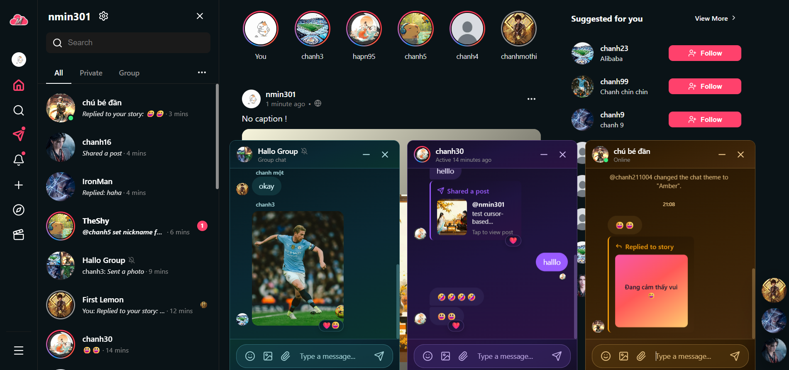
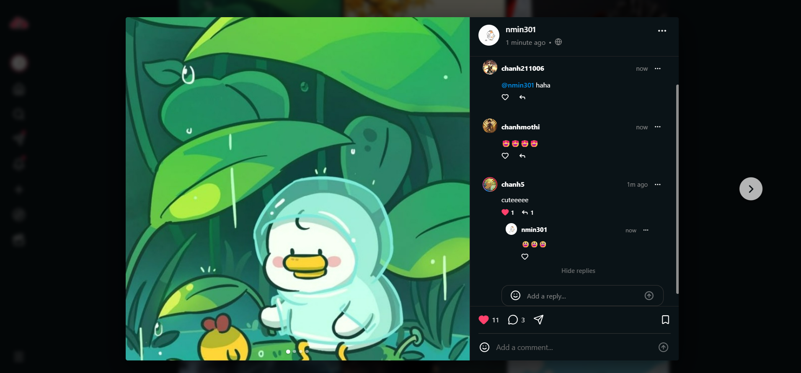
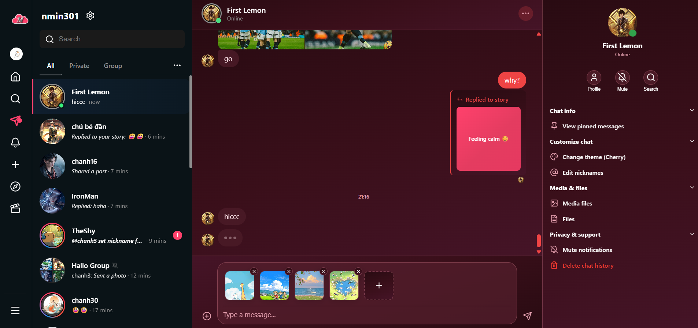
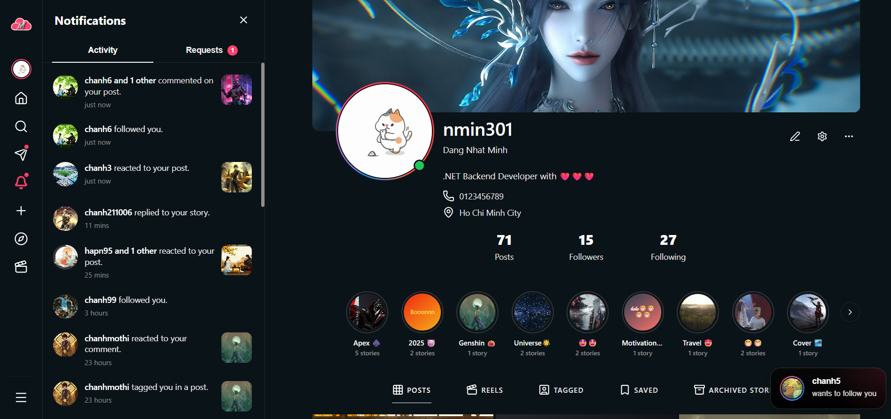
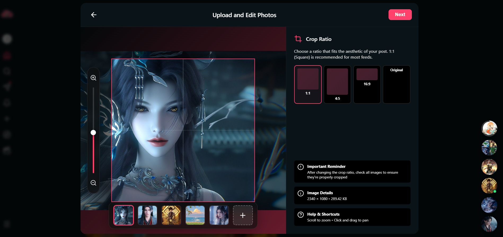

# CloudM Backend API

<div align="center">
  <p>
    
  </p>
  <p><strong>A backend project built to reflect real social product behavior, not just isolated CRUD features.</strong></p>
  <p>
    CloudM is a social networking project inspired by Facebook and Instagram, with familiar features such as profiles, posts, comments, stories, realtime chat, notifications, follow relationships, search, and moderation.
  </p>
  <p>
    The project focuses on real product behavior rather than isolated demo features, especially around privacy, interaction flows, content delivery, and day-to-day social communication.
  </p>
  <p>
    <a href="https://www.cloudm.fun">Live frontend</a>
    ·
    <a href="https://api.cloudm.fun/swagger/index.html">Swagger</a>
    ·
    <a href="https://github.com/minhdn30/CloudM.Client">Frontend repository</a>
  </p>

  <p>
    <a href="https://dotnet.microsoft.com/">
      
    </a>
    <a href="https://www.postgresql.org/">
      
    </a>
    <a href="https://redis.io/">
      
    </a>
    <a href="https://learn.microsoft.com/aspnet/core/signalr/introduction">
      
    </a>
    <a href="https://www.docker.com/">
      
    </a>
  </p>
</div>

## Screenshots

<p align="center"><sub>Some key product screens from CloudM.</sub></p>

<table>
  <tr>
    <td align="center" width="50%">
      
    </td>
    <td align="center" width="50%">
      
    </td>
  </tr>
  <tr>
    <td align="center" width="50%">
      
    </td>
    <td align="center" width="50%">
      
    </td>
  </tr>
  <tr>
    <td align="center" colspan="2">
      
    </td>
  </tr>
</table>

## About This Project

- This repository contains the backend for the live CloudM application, not just a collection of isolated APIs.
- The codebase is organized around real product features such as follow privacy, posts, stories, chat, notifications, search, and moderation.
- It also includes the parts that usually matter in actual work: realtime delivery, background processing, media integration, and deployment.
- My goal with this project was to build something that feels close to a real product backend, not a demo made only to show CRUD endpoints.

## Product Logic Highlights

- Feed delivery is not just chronological. The backend includes score-based feed ranking with configurable ranking profiles, signed cursors, and tuned access indexes for feed queries.
- Search is not a simple `LIKE` query. Sidebar search uses ranking, fuzzy similarity, and search history so the result order feels closer to an actual product.
- Privacy rules are part of the core behavior: follow privacy, default post privacy, story visibility, and online status visibility all affect what users can see and do.
- Moderation is treated as a real workflow, with user reports, admin actions, and audit logs instead of one-off delete endpoints.
- Notifications and presence are handled with asynchronous and realtime paths rather than mixing everything into the request cycle.

## Core Capabilities

| Domain | Highlights |
| --- | --- |
| Authentication | Register, login, logout, refresh token, Google login, forgot password, password reset |
| Accounts | Profile management, settings, account status handling, blocking |
| Social Graph | Follow, unfollow, follow requests, privacy-aware relationship behavior |
| Content | Posts, comments, reactions, saves, post tagging, media-backed creation flows, score-based feed ranking |
| Stories | Story creation, viewers, reactions, archive, highlights |
| Messaging | Private chat, group chat, reactions, pinned messages, media sharing |
| Notifications and Presence | Notification outbox, unread state, online presence, realtime activity |
| Search and Moderation | Ranked sidebar search, search history, report workflows, moderation actions, admin audit logs |

## Architecture

| Layer | Responsibility |
| --- | --- |
| `CloudM.API` | Controllers, middleware, SignalR hubs, Swagger, authentication wiring, service registration |
| `CloudM.Application` | Business services, DTOs, orchestration, validation, mapping, product rules |
| `CloudM.Domain` | Entities, enums, exceptions, and core business models |
| `CloudM.Infrastructure` | EF Core, repositories, migrations, Redis, Cloudinary, Resend email, hosted workers |
| `CloudM.Tests` | Service and repository tests for important backend behavior |

### Realtime and Background Work

Realtime behavior is an important part of the project, so the backend includes:

- SignalR hubs: `ChatHub`, `PostHub`, `UserHub`
- Hosted workers for notification outbox delivery, presence cleanup, email verification cleanup, follow auto-accept, and deferred Cloudinary deletion
- Redis-backed online presence and rate limiting, with memory fallbacks where appropriate

## Production and Operations

- Live API: [https://api.cloudm.fun/swagger/index.html](https://api.cloudm.fun/swagger/index.html)
- Docker Compose production stack with `api`, `postgres`, `redis`, `caddy`, and a migration tool container
- GitHub Actions deployment workflow using a self-hosted runner
- Daily PostgreSQL backup scripts for production safety
- Environment-based configuration for JWT, database, Redis, media, email, and deployment domains

## What I Wanted To Show In This Repository

This repository reflects the kind of backend work I enjoy most:

- service-layer business logic instead of controller-heavy CRUD
- product-scale social features with non-trivial rules and edge cases
- realtime coordination with SignalR and asynchronous workers
- practical infrastructure integration with PostgreSQL, Redis, Cloudinary, Resend, and Docker
- production-minded backend ownership, not just local development

## Technology Stack

| Area | Technologies |
| --- | --- |
| API and Application | ASP.NET Core 8, JWT Bearer, Swagger / OpenAPI, AutoMapper, FluentValidation |
| Data and Persistence | PostgreSQL, EF Core 8, Npgsql, repositories, migrations, targeted indexes |
| Search and Performance | `pg_trgm`, `unaccent`, feed ranking profiles, ranked search, Redis caching, Redis rate limiting, memory fallbacks |
| Realtime and Background Jobs | SignalR, hosted services, notification outbox worker, follow auto-accept, presence cleanup |
| Media and Communication | Cloudinary, Resend, Google authentication |
| Security | BCrypt password hashing, refresh tokens, global exception middleware, environment-based secrets |
| Testing | xUnit, Moq, FluentAssertions, EF Core InMemory, coverlet |
| Operations | Docker, Docker Compose, Caddy, GitHub Actions self-hosted runner |

## Repository Structure

```text
CloudM/
|-- CloudM.API/
|-- CloudM.Application/
|-- CloudM.Domain/
|-- CloudM.Infrastructure/
|-- CloudM.Tests/
|-- docs/
|   `-- images/
|-- CloudM.sln
`-- Dockerfile
```

## Getting Started

### Prerequisites

- .NET SDK 9 for the full solution workflow
- PostgreSQL
- Redis

Runtime projects target .NET 8, while the current test project targets .NET 9.

### Restore and Build

```bash
dotnet restore CloudM.sln
dotnet build CloudM.sln
```

### Run the API

```bash
dotnet run --project CloudM.API/CloudM.API.csproj
```

### Apply Migrations

```bash
dotnet ef database update --project CloudM.Infrastructure --startup-project CloudM.API
```

### Local Configuration

Use `CloudM.API/appsettings.Local.json` or environment variables for local secrets. Important values include:

- `ConnectionStrings__Default`
- `ConnectionStrings__Redis`
- `Jwt__Key`
- `EmailVerification__OtpPepper`
- `ExternalAuth__Google__AllowedClientIds`
- `Cloudinary__CloudName`
- `Cloudinary__ApiKey`
- `Cloudinary__ApiSecret`
- `Email__ResendApiKey`

Do not commit real secrets.

## Testing

Current tests cover services and repositories around:

- auth
- accounts
- follows
- posts and comments
- stories and highlights
- notifications
- conversations and messages

Run tests with:

```bash
dotnet test CloudM.Tests/CloudM.Tests.csproj
```
